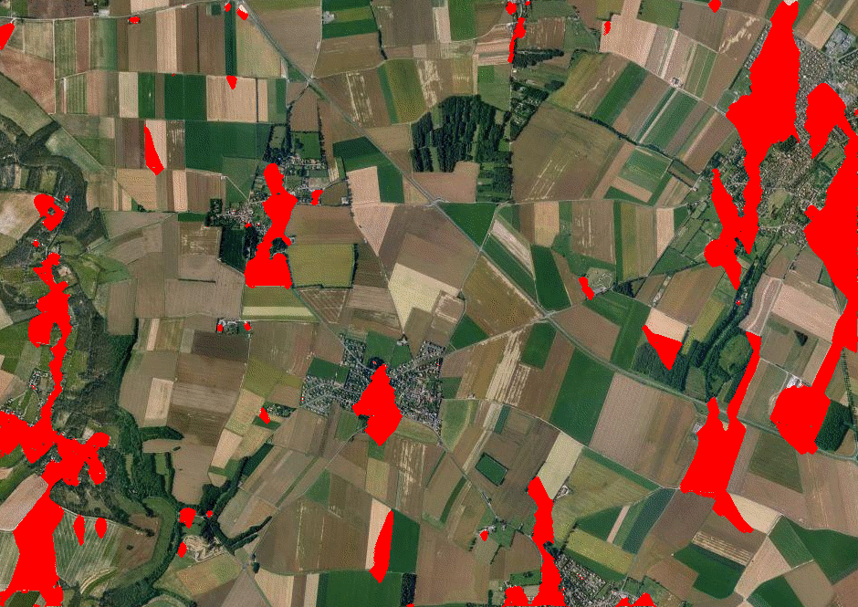
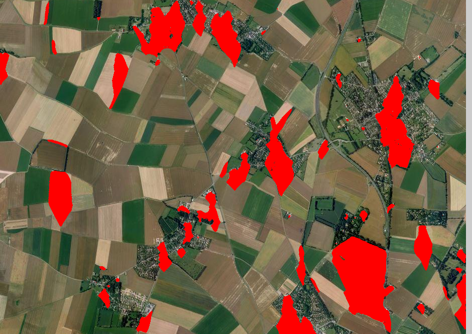

# Imageworks

## About
Imageworks is a collection of real-world digital image processing applications created from scratch. Every example is created in Processing, a language that serves as a graphical sketchbook. To learn more about Processing, click [here](https://processing.org/).

## Contents

### Detecting Urban Areas from Arial Images

| Before | After |
| ------ | ----- |
|  |  |
|  |  |
|  |  |
|  |  |

**Method**

This example utilizes a modified variance formula that factors in differences in color and distance to determine if a pixel is part of an urban area. For each pixel, a 30-50 pixel box around it is evaluated. For every pixel within this range, the average color within the range is subtracted from this pixel's color, and then divided by its distance from the center pixel. This ensure that pixels closer to the center have higher priority. This value for all pixels is calculated and averaged, resulting in our value for urban estimation. The last step is to create a threshold value to determine above which point are pixels considered part of urban areas.

### Detecting License Plates from Images

| Before | After |
| ------ | ----- |
|  |  |
|  |  |
|  |  |
|  |  |

**Method**

It's simple to detect the exact location of the license plate given a rough estimation of the width of the characters. This is because morphology allows easy manipulation and isolation of character-like structures. First, the image is dilated, setting each pixel to the brightest value based on a structuring element. The structuring element serves as the range for each pixel. Because we want to also completely dilate the license plate characters, the structuring element only needs to be half the width of each character. Then, the image is reconstructed by erosion as much as possible, using the original image as the basis of reconstruction. Erosion is similar to dilation, except each pixel is set to the lowest surrounding value. The reason why the text can be isolated using this method of dilation and erosion is because the text shouldn't be able to reconstruct the darkness of it's original image as information is lost during the dilation and unrecoverable from erosion. This is due to the thin structure of the characters. However, other parts of the image such as the car itself will be able to reconstruct, because the broad and consistent colorations of the car ensure that not all information is lost during dilation. Therefore, taking the difference between the reconstructed image and the original will yield only the license plate text.

### Removing Straight Lines from an Image

| Before | After |
| ------ | ----- |
|  | |
|  |  |

**Method**

To isolate the straight lines within an image, the first step is to prepare the image by displaying only the edges and creating the binary image. Edge detection can be done using the Sobel or Prewitt Operator. This consists of evaluating each pixel relative to a horizontal and vertical mask. High values indicate high likelihood of an edge. After constructing all of the edges, the Hough Transform can be used to return a number of lines based on a threshold. With the Hough Transform, each edge point is represented as a polar coordinate, and each of these coordinates is evaluated at a number of angles depending on precision. For each of these coordinate-theta pairs, a rho value is calculated and must be stored to determine the maximum. The theta-rho pair with the highest count will determine which perpendicular line in the image is the most significant. Setting a threshold for the theta-rho value will allow control of how many lines the Hough Transform returns. And given these lines, the corresponding areas in the original image can be filtered.